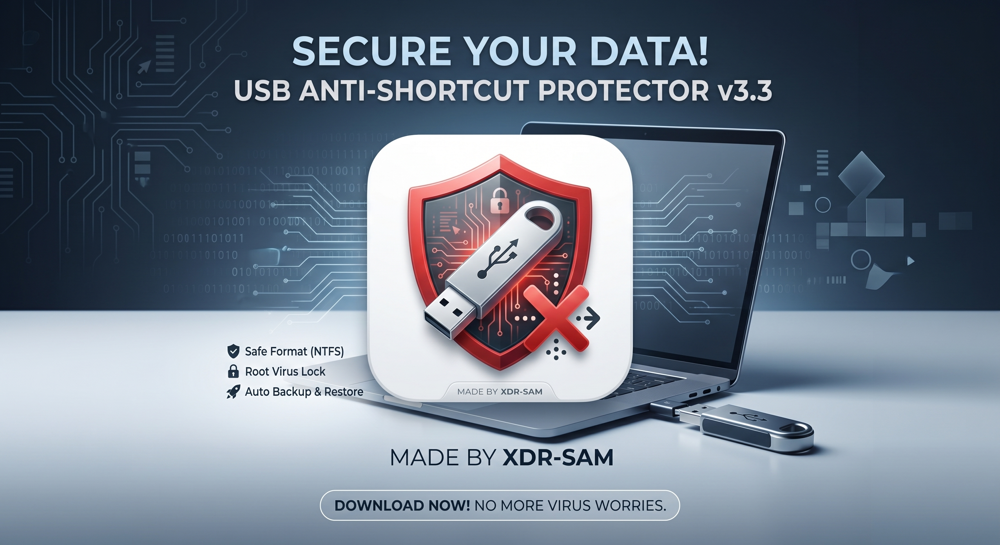

# 🛡️ USB Shield



**Powered by XDR-SAM**  
*Safe Format · Virus Lock · Auto Backup*

---

## Why we built this

USB drives are one of the most common ways malware spreads — shortcut viruses, autorun scripts, and hidden trojans can turn a simple flash drive into a delivery vehicle. Most users don’t have a clean, one-click way to:

- Back up their files safely before cleaning a drive  
- Reformat the USB to a fresh NTFS filesystem  
- Lock the root so malicious scripts can’t drop files there  
- Restore their data back into a protected folder

**USB Shield** automates all of that in a single click.

---

## What it does

1. **Detects** connected USB drives automatically  
2. **Backs up** your files to `Desktop\USB_Backup_<drive>` before touching anything  
3. **Formats** the USB to clean NTFS  
4. **Creates** a `My_Files` folder as the only writable location  
5. **Locks** the USB root to block viruses from dropping shortcuts/scripts  
6. **Restores** your files back into `My_Files` and cleans up the temp backup  

---

## Features

- One-click format + protect workflow  
- Auto backup & restore with `robocopy`  
- Root-level ACL lock using Windows `icacls`  
- Real-time live log console inside the GUI  
- Admin-elevated launch with UAC prompt  
- Safe threading so the UI never freezes  

---

## Requirements

- Windows 10 / 11  
- Python 3.8+ (Tkinter comes bundled with standard CPython on Windows)  
- Administrator privileges  

---

## How to run

```bash
python usb_protector.py
```

> The app will auto-elevate itself via UAC. If you decline admin rights, it exits safely.

---

## Usage

1. Plug in your USB drive  
2. Open **USB Shield**  
3. Select your USB from the dropdown and hit **Refresh** if needed  
4. Toggle **Auto Backup & Restore Files** on/off  
5. Click **🛡️ Format & Protect USB**  
6. Wait for the progress bar and live logs  
7. Done — use the `My_Files` folder on the USB for all future work  

---

## How the protection works

| Layer | Action |
|-------|--------|
| Backup | Copies all files to Desktop before formatting |
| Format | Rewrites the drive as clean NTFS |
| Root lock | Denies `Write Data` + `Append Data` to `Everyone` on the USB root |
| User folder | Grants full control only inside `My_Files` |

This blocks most shortcut/vbs/bat droppers while keeping your files fully usable.

---

## Disclaimer

This tool **formats USB drives**. All data on the selected drive will be erased.  
Use the built-in backup option, or back up manually before running.  
The author is not responsible for data loss.

---

## Credits

Made by **XDR-SAM**

## Assets

- `assets/banner.jpg` – project banner  
- `assets/usb-shield-logo.png` – app logo
